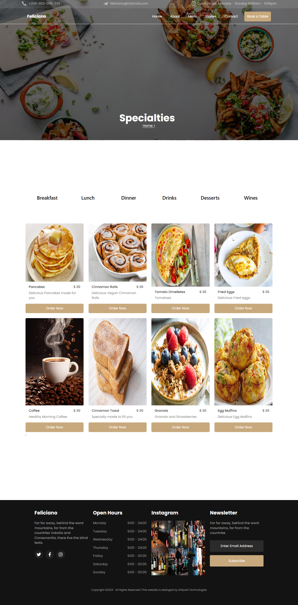
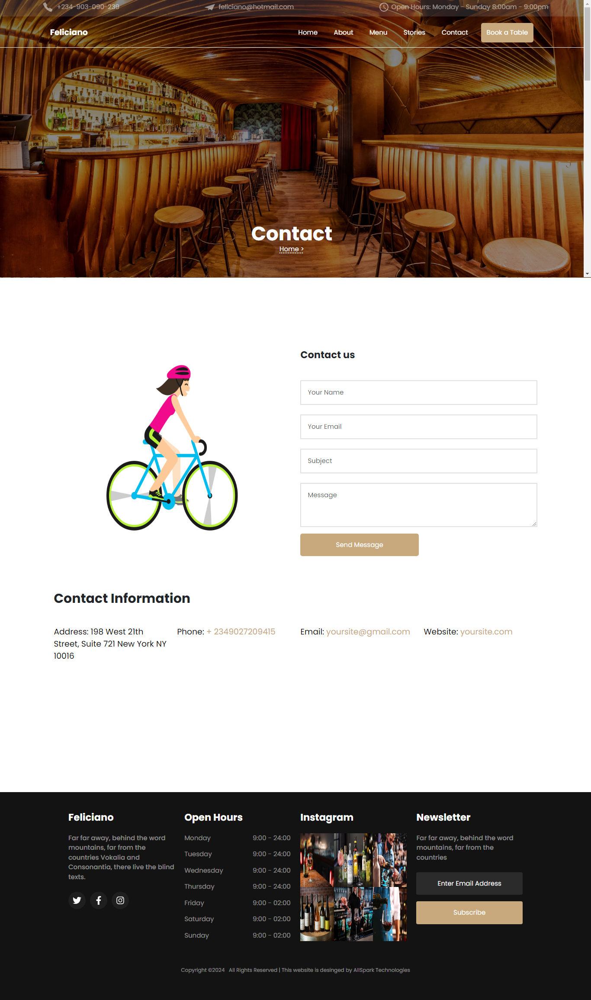
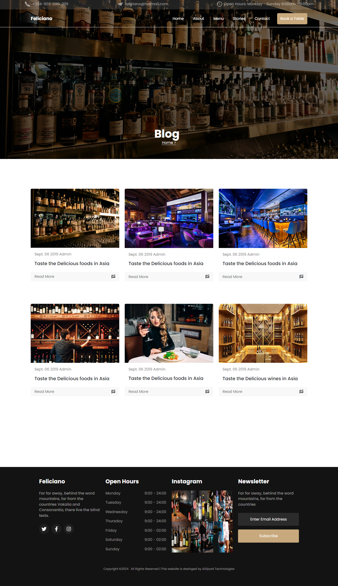

##Feliciano Restaurant Website

Welcome to the repository for the **Feliciano Restaurant Website**! This project is a modern, responsive website built using React.js, Bootstrap, CSS, Framer-Motion, AOS,. It aims to provide a seamless and engaging experience for users looking to explore the restaurant's menu, make reservations, and learn more about the restaurant.

## Features

- **Responsive Design**: The website is fully responsive and works on all devices (mobile, tablet, and desktop).
- **Interactive Menu**: Users can browse the menu with detailed descriptions and images.
- **Online Reservations**: Users can make reservations directly through the website.
- **Contact Form**: A contact form for users to send messages and inquiries.
- **Dynamic Content**: Uses React components to dynamically render content.

## Screenshots

## Usage

- **Home Page**: Displays the restaurant's welcome message and key features.
- **Menu**: Browse through different categories of dishes with images and descriptions.
- **Reservations**: Fill out the form to make a reservation.
- **Contact**: Send a message to the restaurant using the contact form.

## Built With
# React + Vite

This template provides a minimal setup to get React working in Vite with HMR and some ESLint rules.

- [React.js](https://reactjs.org/) - A JavaScript library for building user interfaces
- [React Router](https://reactrouter.com/) - For navigation and routing
- [Styled Components](https://styled-components.com/) - For styling the application
- [AOS](https://github.com/michalsnik/aos) - For Scroll Animations
- [Splide.Js React Splide](https://splidejs.com/integration/react-splide/) - For Splide Carousels/ Sliders
- [React-Bootstrap](https://react-bootstrap.github.io/) - For additional styling
- [React-Icons](https://react-icons.github.io/react-icons/) - For SVG icons
- [React-Scroll Trigger](https://www.npmjs.com/package/react-scroll-trigger) - For Onscroll Trigger animations

- [@vitejs/plugin-react](https://github.com/vitejs/vite-plugin-react/blob/main/packages/plugin-react/README.md) uses [Babel](https://babeljs.io/) for Fast Refresh
- [@vitejs/plugin-react-swc](https://github.com/vitejs/vite-plugin-react-swc) uses [SWC](https://swc.rs/) for Fast Refresh
#

## Contributing

Contributions are what make the open-source community such an amazing place to learn, inspire, and create. Any contributions you make are **greatly appreciated**.

If you have a suggestion that would make this better, please fork the repository and create a pull request. You can also simply open an issue with the tag "enhancement".

1. Fork the Project
2. Create your Feature Branch (`git checkout -b feature/AmazingFeature`)
3. Commit your Changes (`git commit -m 'Add some AmazingFeature'`)
4. Push to the Branch (`git push origin feature/AmazingFeature`)
5. Open a Pull Request

## Contact

Ikangenyin Abasiono Alexander - [allsparktech1@gmail.com](mailto:allsparktech1@gmail.com)

Project Link: [https://github.com/AllSparkTech/Feliciano_restaurant_design](https://github.com/AllSparkTech100/Feliciano_restaurant_design)

## Acknowledgments

- Thanks to @Colorlib.com/Feliciano for there amazing restaurant website template.
